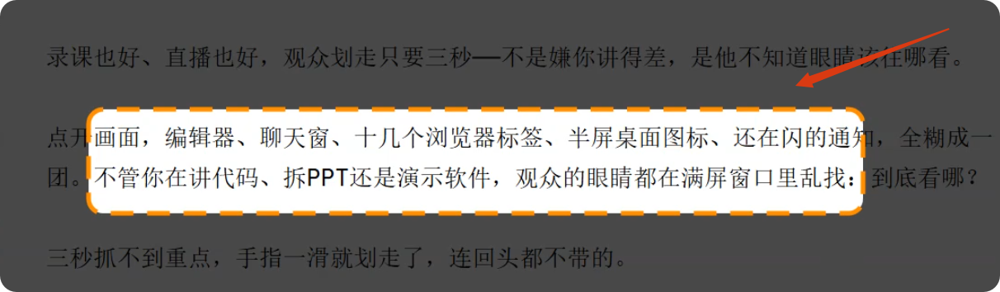

# FocusZoneWin

English | [中文](README.md)

A full-screen focus-mask tool for Windows. While recording courses or streaming demos, it dims everything except the area you want your audience to look at.


## Effect



A full-screen dark overlay covers the desktop, with a bright "spotlight" cut out only within your selection. The control bar floats anywhere on screen.

## Usage

```
FocusZoneWin.exe
```

On launch, a tray icon appears in the bottom-right of the taskbar and a floating control bar shows up on screen.


| Action | How |
|--------|-----|
| Enter selection | Click **▶ Select** on the control bar, press `Ctrl+Shift+S`, or double-click the tray icon |
| Draw selection | The screen freezes; drag with the mouse to draw a box, release to lock it |
| Confirm & exit | Press `ESC` or right-click |
| Adjust darkness | Drag the **🌙 slider** (0–100%) |
| Change border color | Click the **■ color button** (blue / green / orange / red / purple / cyan) |
| Switch line style | Click **⬜ dashed / solid** |
| Hide from capture | Click **🔴 Capture** to toggle the control bar's visibility to OBS / screen sharing |
| Quit | Click **✕ Exit** |
| Move control bar | Hold the left mouse button and drag |

## Selection flow

1. Click **▶ Select**
2. The screen freezes (snapshot); color and darkness controls are automatically locked
3. Drag to box the focus area and release to lock it
4. Press **ESC** or **right-click** to confirm and exit; the mask takes effect
5. Press **ESC** or **right-click** again to turn the mask off; controls unlock

> The screen stays frozen during selection until you confirm. You can tweak parameters and re-draw the box repeatedly within a single selection round.

## Command line

```
FocusZoneWin --selftest    # self-test mode
```

## Configuration

The config file is stored automatically at `%APPDATA%\FocusZoneWin\config.json`, containing:
- darkness, selection position, border color index, control bar position, hide-from-capture toggle

Delete this file to restore default settings.

## Hotkeys

| Hotkey | Function |
|--------|----------|
| `Ctrl+Shift+S` | Re-select area |

## Build

```
dotnet build -c Release
```

Output: `bin/Release/net8.0-windows/FocusZoneWin.exe`

Requirements: .NET 8 SDK, Windows (WPF)

## Contact

For questions or suggestions, feel free to reach out:

- WeChat：HgAiAgent (scan the QR code to add me)
- Email：[szlihui801@gmail.com](mailto:szlihui801@gmail.com)


## Changelog

### v1.0.3

- **Frozen controls during selection**: Color button and darkness slider auto-lock on entering selection, unlock on exit
- **Crash protection**: try-catch on exit cleanup, signal listener, selection failure paths — no more silent crashes
- **Fallback mechanisms**: Hotkey registration failure warning, OS version check for capture exclusion, virtual screen fallback to primary
- **Code cleanup**: Removed dead Ctrl+Shift+D code, unused NativeMethods hooks, BandColors triplicate definitions

### v1.0.2

- Fix residual selection artifact, crash, and exception handling

## License

Released under the [MIT License](LICENSE) — free to use, modify, and distribute.
